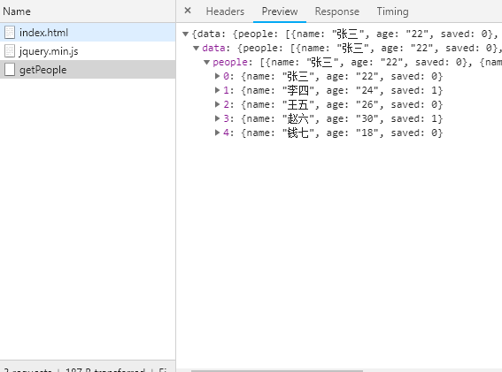
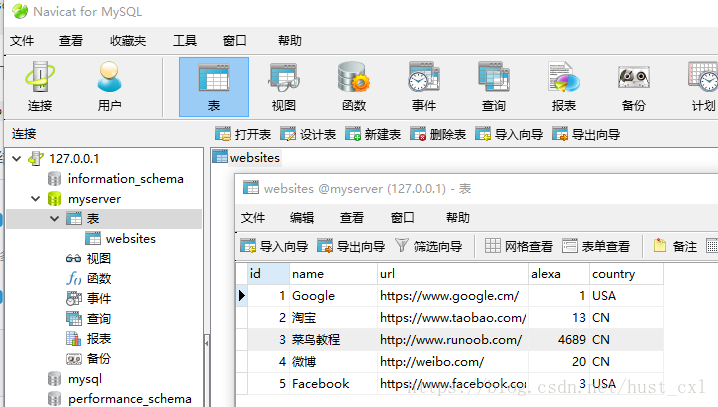
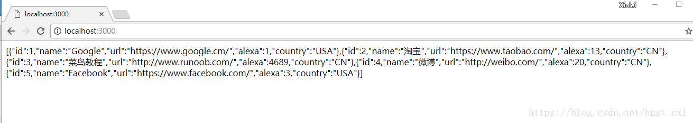
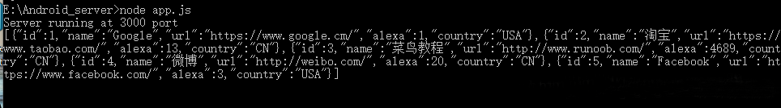

# Node.js本地数据，数据库数据练习
  
# NodeJs本地数据提取
虽然在平时公司做项目时候是前后端分离的模式，但是有时候前端人员做好了页面无奈只能等待后端做好了接口后才能测试（针对我自己这种情况而言），这样就拖延了很多时间，有多余时间不如我们自己用nodeJs模拟数据做个接口自己测试，之后把测试结果，数据类型等等丢给后端就完事了，而且nodeJs对于前端来说根本没什么学习成本，除了nginx和数据库的操作这些，方法等等用JS来写就可以了，所以觉得有闲余的时间不如学一下。  
使用方法  
cd index.js目录  
CMD输入 node index.js(.js可省略)  
打开同目录的index.html查看数据并查看页面渲染效果  
node.js+express+body-parser+cors  
数据类型：  
{'data':{
  'people': [
    {name: '张三',age: '22',saved: 0},
    {name: '李四',age: '24',saved: 1},
    {name: '王五',age: '26',saved: 0},
    {name: '赵六',age: '30',saved: 1},
    {name: '钱七',age: '18',saved: 0}
  ]
 }}  
演示图片：  

  
# NodeJs数据库数据提取
使用方法同本地数据提取，只是添加了在数据库里建表插入数据，然后nodeJs连接数据库，从数据库取数据，关闭数据库的过程。  
node.js+express+body-parser+cors+mysql  
数据类型：  
[{id:1,name:'Google‘,url:'www.google.com',alexa:1,country:'USA'}].........  
演示图片：  

  
